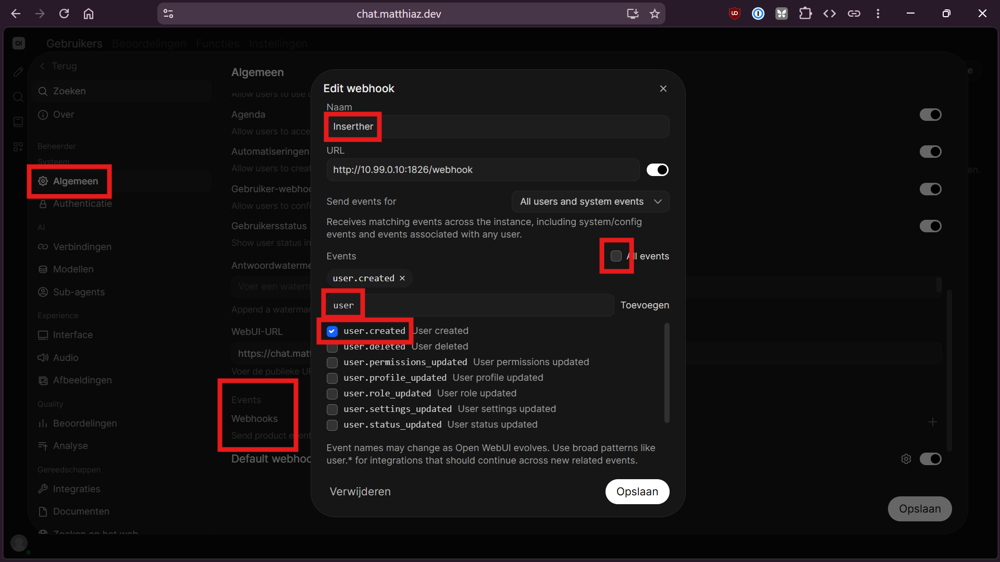
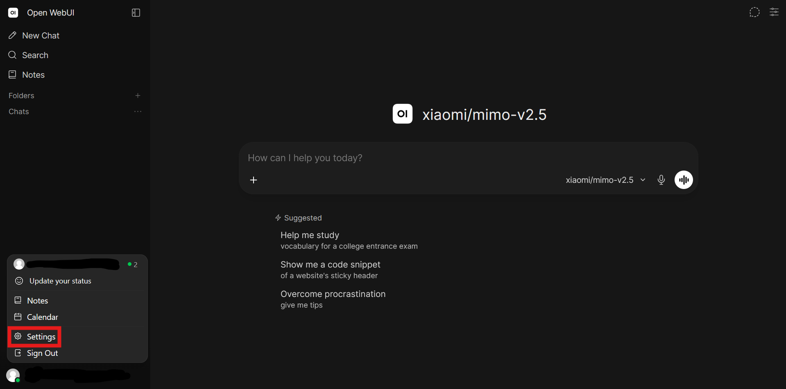
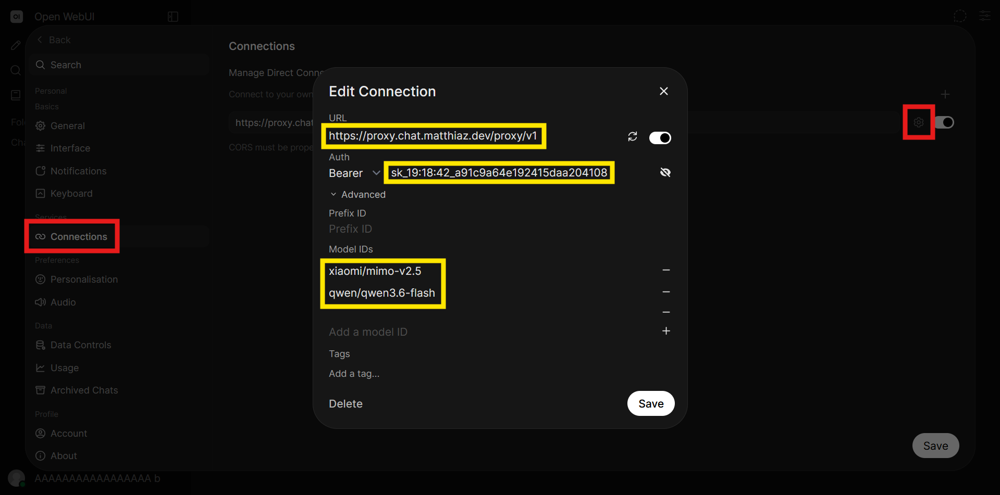

# Open HackUI
[Hack Club](https://hackclub.com)'s free Open WebUI instance, with automatic key insertion from [ai.hackclub.com](https://ai.hackclub.com)!
Try it out here: [chat.matthiaz.dev](https://chat.matthiaz.dev/)

## how?
Non-exhaustive list of setup steps:
1. Clone the repo (duh) `git clone https://github.com/MatthiasLubbertsen/open-hackui.git` and `cd open-hackui`
2. Run `cp .env.example .env`
3. Fill in these vars:
    - OAUTH_CLIENT_ID
    - OAUTH_CLIENT_SECRET
    - WEBUI_SECRET_KEY (create with `openssl rand -hex 32`)
4. Run `docker compose up -d`

Open HackUI should be up and running on `localhost:1927` and the proxy on `localhost:9173`. Deploy both to an domain.

Make sure to edit these vars to their deployed urls in `.env`:
- `EXTERNAL_PWA_MANIFEST_URL`
- `WEBUI_URL`
- `PROXY_URL` 

You might need to run `docker compose down && docker compose up -d` for the changes to apply!

Or just use my deployed version: [chat.matthiaz.dev](https://chat.matthiaz.dev/)

### stupid manual steps:
1. login with your admin account
2. go to the admin panel
3. and go to General
4. scroll down and change the settings as indicated in the screenshot:

I can't control this with `.env` vars because Open WebUI did an update without env config 😭 I made a github issue [here](https://github.com/open-webui/open-webui/issues/26650), hopefully they fix it soon 

## and now?
It inserted a (dummy for now (it has a timestamp in it)) api key for ya! Along with a proxy to have CORS working good, and some preconfigured models (so no expensive ones are used). How to check:
1. First, open settings:

2. Follow the red squares, and see the stuff configured in yellow:

3. (optionally, to see the proxy working) get a new key from [ai.hackclub.com](https://ai.hackclub.com) and put it in the api key field, and go chatting!

You might wanna reload the page, maybe we are too fast :p

Feel free to use [this](https://chat.matthiaz.dev/) deployed one!

(the slow response times are not my fault, it's Hack Club AI 🤷)

Once ~~mahad responds to my dms~~ I get some stuff sorted out, the api key will be a real key from [ai.hackclub.com](https://ai.hackclub.com) and you can use it instantly!

## what?
This will sound a bit cunfusing. If you don't get it, I'd love to explain it to you! Contact [me on the Slack](https://hackclub.enterprise.slack.com/team/U0A55A4B21K) or use [#open-hackui](https://hackclub.enterprise.slack.com/archives/C0B8SN92ALR).

Open WebUI has an admin webhook feature, wich fires when a new user is made. This webhook is configured to Inserther. Wehn Inserther recieves the webhook, these steps are followed:
1. We make an JWT (Json Web Token) with the given `userId` and the signing secret that Open HackUI uses. Now we have a valid JWT token for the user, wich we can use to make changes on the user settings on behalf of the user.
2. We make a dummy api with a timestamp
3. It fetches the current user settings (wich is `null` but we don't care) on behalf of the user (with the JWT), and set the direct connections to the nginx proxy and the api key to the api key of step 2. 
4. (when an user is not an verified teen, we dont get an key from ai.hackclub.com and stop there.)

# who?
[ai.hackclub.com](https://ai.hackclub.com) exists, but there is no general UI. A lot of Hack Clubbers made some (including [me](https://github.com/MatthiasLubbertsen/HatGPT)!), but none have all features. I used Open WebUI in the past and it feels super polished. <!-- crazy scentence, update it -->

After months of DMs with @skyfallwastaken (mahad), Open HackUI was born. A free UI for Hack Clubbers, with some more convienence. 

<!--- TODO: 
- [x] make readme from memos
- [x] webmanifest
- [x] init
- [x] vars to fill in .env - dont forget url
- [ ] add `PROXY_URL` to `Inserther/server.js` ---!>
